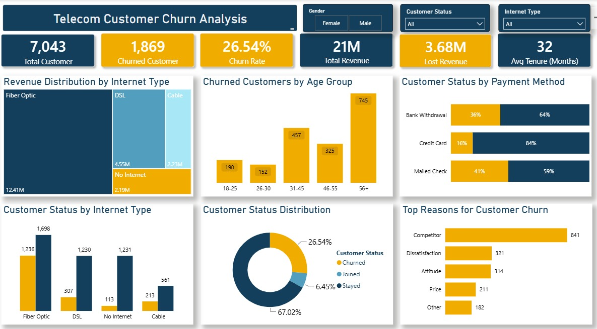
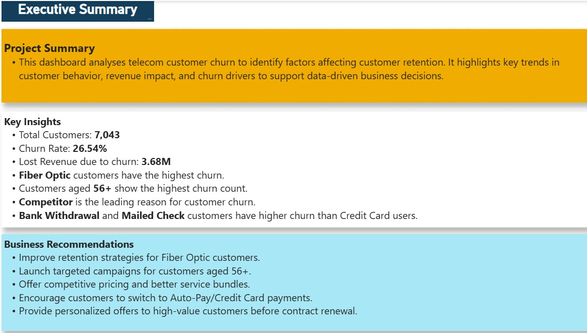

# Telecom Customer Churn Analysis 📊

## Project Overview
This is a practice project focused on analyzing customer churn in the telecommunications industry using Power BI.

The objective is to understand customer churn patterns, identify customer segments associated with churn, and explore the potential impact on revenue.

## Project Type
Practice Project

## Tools & Technologies
- Power BI
- DAX
- Power Query
- Data Visualization

## Dataset
The project uses a telecom customer churn dataset containing customer information, services, account details, and churn-related attributes.

The dataset is available in the [Dataset folder](Dataset/).

## Key Performance Indicators (KPIs)
- Total Customers
- Churned Customers
- Churn Rate
- Total Revenue
- Lost Revenue
- Average Customer Tenure

## Analysis Performed
- Customer churn patterns
- Churn across different age groups
- Churn by internet service type
- Churn by payment method
- Customer tenure analysis
- Churn reasons
- Revenue impact of customer churn

## Power BI Skills Practiced
- Data cleaning and transformation using Power Query
- Creating DAX measures
- KPI development
- Interactive slicers and filters
- Data visualization and dashboard design
- Presenting business insights

## Key Insights
- The overall churn rate was approximately 26.54%.
- Competitor-related issues were a leading reported reason for churn.
- Churn patterns varied across customer age groups and internet service types.
- Customer payment methods showed differences in churn behavior.

## Business Recommendations
- Investigate competitor-related churn and customer feedback.
- Develop targeted retention strategies for higher-risk customer segments.
- Review customer experiences across different internet service types.
- Use customer tenure and churn patterns to guide retention initiatives.

## Dashboard Preview

### Executive Summary

### Customer Churn Analysis

## Project Files
- [Dataset](Dataset/)
- [Power BI Dashboard](PowerBI/)
- [Dashboard Screenshots](Screenshots/)

## Conclusion
This project helped me practice using Power BI, DAX, and data visualization to analyze customer behavior and communicate business insights through an interactive dashboard.
